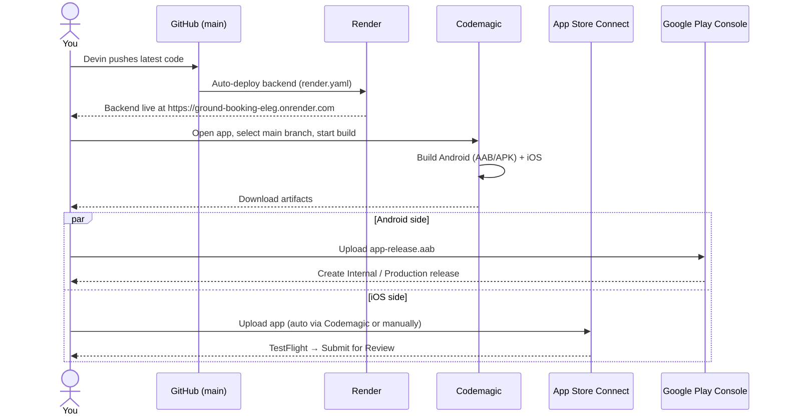

# Elite Turf Booking – Build & Publish Runbook

Each time Devin pushes a new build, follow this sequence to get the web, Android, and iOS versions live.

## Sequence Diagram



## Step-by-step URLs

| # | What to do | URL |
|---|-----------|-----|
| 1 | Confirm the backend is live after a push | https://ground-booking-eleg.onrender.com |
| 2 | Render service dashboard (check deploy status) | https://dashboard.render.com/web/srv-d9nq6b67bikc73cej5r0 |
| 3 | Open the Codemagic app and start a build | https://codemagic.io/apps |
| 4 | Download Android AAB/APK after build | Codemagic Artifacts tab |
| 5 | Upload Android AAB to Play Console | https://play.google.com/console/developers |
| 6 | iOS – App Store Connect (TestFlight / release) | https://appstoreconnect.apple.com/apps |

## Android release

**Recommended: Codemagic**
1. Make sure Codemagic has synced the latest `codemagic.yaml` (refresh the app page or go to **Application settings → Update repository**).
2. In Codemagic, run the **`turf-booking-android`** workflow on the `main` branch.
3. Download `app-release.aab` (and optionally `app-release.apk`) from the **Artifacts** tab.
4. Go to https://play.google.com/console/developers.
5. Select **Elite Turf Booking** → **Release** → **Production**.
6. Click **Create new release** → upload the `.aab` → **Review release** → **Start rollout to Production**.

**Fallback: local build**
- On a machine with Android SDK + Java:
  ```bash
  cd sports-booking-frontend
  npm install
  echo "VITE_API_URL=https://ground-booking-eleg.onrender.com" > .env
  npm run build
  npx cap sync android
  cd android
  ./gradlew bundleRelease assembleRelease
  ```
- Output: `sports-booking-frontend/android/app/build/outputs/bundle/release/app-release.aab` and `.../apk/release/app-release.apk`.

## iOS release

1. In Codemagic, run the **iOS workflow** on the `main` branch.
2. If certificates / App Store Connect API key are set in the `appstore_credentials` environment group, Codemagic uploads automatically to App Store Connect.
3. Open https://appstoreconnect.apple.com/apps → **Elite Turf Booking**.
4. Go to **TestFlight** to add internal testers.
5. When ready: **App Store** tab → **Create new submission** → fill metadata → **Submit for Review**.

## If the production backend URL changes

1. Open the Codemagic app → **Environment variables**.
2. Update `VITE_API_URL` in the `appstore_credentials` group to the new Render URL.
3. Rebuild Android + iOS.

## Pre-build checks for every store release

- `VITE_API_URL` points to the production Render URL.
- `GOOGLE_CLIENT_ID` and `VITE_GOOGLE_CLIENT_ID` are set.
- Android version name / code are bumped in `android/app/build.gradle` or `package.json`.
- iOS version and build number are bumped in `ios/App/App.xcodeproj/project.pbxproj`.
- SMS provider credentials are configured if you want real OTP; until then the app uses demo OTP.

## Files in this repo that control publishing

- `render.yaml` – Render web service settings.
- `codemagic.yaml` – Codemagic build workflows.
- `sports-booking-frontend/capacitor.config.ts` – Capacitor app config.
- `sports-booking-frontend/android/app/build.gradle` – Android version and signing.
- `sports-booking-frontend/ios/App/App.xcodeproj/project.pbxproj` – iOS version and bundle ID.
